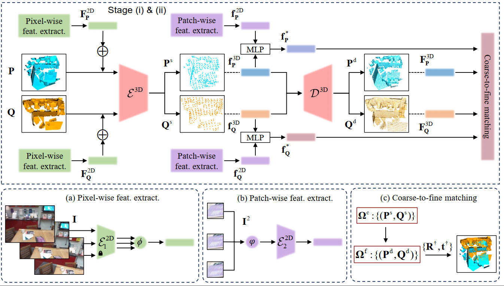

  <h1 align="center">CoFF: Cross-Modal Feature Fusion for Robust Point Cloud Registration with Ambiguous Geometry</h1>
  

    
    
    <a href="https://arxiv.org/pdf/2505.13088">.svg?style=flat-square" /></a>
    
  
  

  

    <a href="https://zhaoyiww.github.io/"><strong>Zhaoyi Wang</strong></a>
    ·
    <a href="https://shengyuh.github.io/"><strong>Shengyu Huang</strong></a>
    ·
    <a href="https://gseg.igp.ethz.ch/people/scientific-assistance/jemil-avers-butt.html"><strong>Jemil Avers Butt</strong></a>
    ·
    <a href="https://github.com/yuanjua"><strong>Yuanzhou Cai</strong></a>
    ·
    <a href="https://github.com/mvarga1989"><strong>Matej Varga</strong></a>
    ·
    <a href="https://gseg.igp.ethz.ch/people/group-head/prof-dr--andreas-wieser.html"><strong>Andreas Wieser</strong></a>
  

  
<a href="https://ethz.ch/en.html"><strong>ETH Zürich</strong></a>

  

This is the official Pytorch implementation of the paper: [paper](https://arxiv.org/abs/2505.13088)

## Abstract

    
[Abstract (click to expand)]

Point cloud registration has seen significant advancements with the application of deep learning techniques. However, existing approaches often overlook the potential of integrating radiometric information from RGB images. This limitation reduces their effectiveness in aligning point clouds pairs, especially in regions where geometric data alone is insufficient. When used effectively, radiometric information can enhance the registration process by providing context that is missing from purely geometric data. In this paper, we propose CoFF, a novel Cross-modal Feature Fusion method that utilizes both point cloud geometry and RGB images for pairwise point cloud registration. Assuming that the co-registration between point clouds and RGB images is available, CoFF explicitly addresses the challenges where geometric information alone is unclear, such as in regions with symmetric similarity or planar structures, through a two-stage fusion of 3D point cloud features and 2D image features. It incorporates a cross-modal feature fusion module that assigns pixel-wise image features to 3D input point clouds to enhance learned 3D point features, and integrates patch-wise image features with superpoint features to improve the quality of coarse matching. This is followed by a coarse-to-fine matching module that accurately establishes correspondences using the fused features. We extensively evaluate CoFF on four common datasets: 3DMatch, 3DLoMatch, IndoorLRS, and the recently released ScanNet++ datasets. In addition, we assess CoFF on specific subset datasets containing geometrically ambiguous cases. Our experimental results demonstrate that CoFF achieves state-of-the-art registration performance across all benchmarks, including remarkable registration recalls of 95.9% and 81.6% on the widely-used 3DMatch and 3DLoMatch datasets, respectively. CoFF is particularly effective in scenarios with challenging geometric features, provided that RGB images are available and that the overlapping regions exhibit sufficient texture in the RGB images.

## TODO list
- [ ] Upload the complete code for the paper.